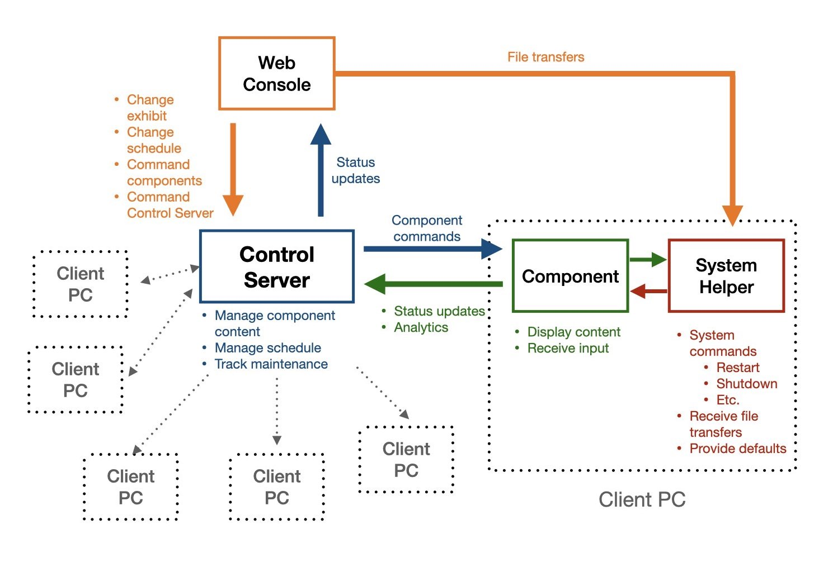

# Constellation
Open-source control software for museum exhibits

## System architecture

</img>

**_Constellation_** operates using a server-client model. Only the central Control Server requires a static IP address; client devices contact the server at that address and identify themselves with an `id` and `type`, as well as their current network address.

A responsive web console provides system administrators with an easy way to control both the Control Server and various client `component`s. The server caches these commands, which are passed on to the client when they next check into the Control Server.

**Note:** At this time, **_Constellation_** operates with unsecured HTTP connections. If you plan to deploy on a wireless network, make sure the network is secured.

## Available components

**_Constellation_** provides a number of `component` types, enabling the creation of a diverse array of digital exhibit pieces.

| Component | Description |
| ----------- | ----------- |
| Flexible Tracker | Build simple touch interfaces to help evaluators or other staff collect information. *Distributed as part of Control Server*. |
| Heartbeat | Provides basic **_Constellation_** monitoring for clients not running another `component`. |
| Media Browser | Browse and view a collection of images and videos with a touchscreen interface.|
| Media Player | Robust digital signage solution with an optional kiosk for interaction. |
| SOS Kiosk | A public-facing interface for NOAA Science on a Sphere for use on an iPad or other touchscreen. |
| SOS Screen Player | Display additional images or video corresponding to the current dataset displayed on NOAA Science on a Sphere. |
| Voter | Collect visitor feedback with a voting kiosk. *Distributed as part of Control Server*. **This component is in progress** |
| Word Cloud | Display a word cloud with an optional user input kiosk. **This component is in progress** |

## Available utilities

In addition to full-fledged `component`s, **_Constellation_** provides utilities for interacting with other common hardware types.

| Utility | Description | Location |
| ------- | ----------- | -------- |
| iPlayer 3 Control | Interface with the Color Kinetics iPlayer 3 DMX controler. | iplayer3_control/iplayer3_control.py |
| Projector Control | Control projectors using PJLink or serial commands. | control_server/projector_control.py |
| SOS Plot Tools | Python library for creating datasets to display on Science on a Sphere | sos_plot_tools/SoS_plot_tools.py |
