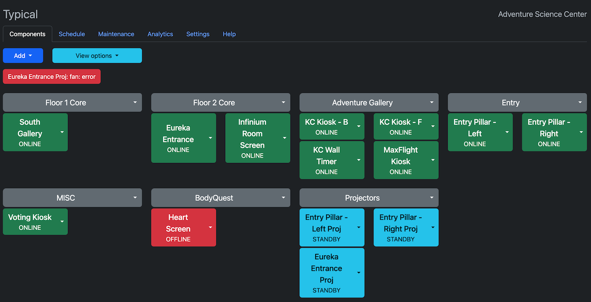

_Constellation is now **Exhibitera**_. [Click here](https://github.com/Cosmic-Chatter/Exhibitera) to visit the new repo.

# Constellation
Open-source software for developing and controlling museum exhibits.

</img>

## Available components

**_Constellation_** provides a number of apps, enabling the creation of a diverse array of digital exhibit pieces.

| Component         | Description                                                                                                                   |
|-------------------|-------------------------------------------------------------------------------------------------------------------------------|
| DMX Control  | Configure and control theatrical lighting systems using the DMX protocol. |
| Flexible Tracker  | Build simple touch interfaces to help evaluators or other staff collect information. *Distributed as part of Control Server*. |
| InfoStation       | Create custom touchscreen interfaces for text and media content.                                                              |
| Media Browser     | Browse and view a collection of images and videos with a touchscreen interface.                                               |
| Media Player      | Robust digital signage solution with an optional kiosk for interaction.                                                       |
| Timelapse Viewer  | Cycle through sets of images using a variety of input methods.                                                                |
| Timeline Explorer | Create interactive timelines using a spreadsheet.                                                                             | 
| Voting Kiosk      | Collect visitor feedback with a voting kiosk.                                                                                 |
| Word Cloud        | Display a word cloud with an optional user input kiosk.                                                                       |
