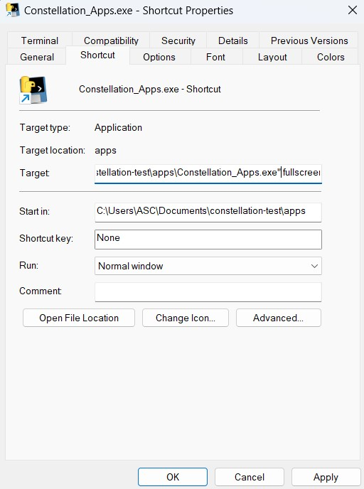

# Exhibitera Apps
A collection of visitor-facing apps to help you create rich digital experiences.

## First-time setup
Exhibitera Apps must be hosted by a PC running Windows, macOS, or Linux, even if the user-facing interface is a mobile device such as an iPad.

### Installation
Download the version appropriate for your operating system [here](https://cosmicchatter.org/constellation/constellation.html) and place the file in the location you would like to run Apps from. Then, launch the file.

On Windows, a wizard will launch to begin setup. On Linux, a command-line setup window will launch, asking you a few basic questions. Once you use the keyboard to answer, Apps will launch and open a graphical interface.

## Configuration

### Using a remote display
By default, Exhibitera Apps will run as self-contained app when using Windows. If you are using a Windows PC as your exhibit computer, you're done!

If you wish to use an iPad or other remote device as your guest-facing interface, or if you are using Linux, Exhibitera Apps needs to run with a remote display. When using a remote display, Exhibitera Apps will launch as a command-line window. You then access the app using a regular web browser. For example, if your PC has a static IP address of `192.168.1.122` and you are using port `8000`, access Exhibitera Apps from `http://192.168.1.122:8000`.

## Deploying Exhibitera Apps
When configuring the app for use in production (i.e., on the museum floor), it is strongly recommended to set it up in kiosk mode. This will lock users into the application and supress many pop-ups.

### Disabling gestures

#### Windows 11
Using Windows 11, you can disable touchscreen gestures from the settings menu.

#### Linux (Ubuntu)
To disable gestures on Ubuntu 22.04 using these commands:

```commandline
wget "https://extensions.gnome.org/extension-data/disable-gestures-2021verycrazydog.gmail.com.v4.shell-extension.zip"

gnome-extensions install disable-gestures-2021verycrazydog.gmail.com.v4.shell-extension.zip

reboot
```

#### macOS
On macOS, it is not possible to hide the dock and menu bar permanently, so macOS is not recommended for use with a touchscreen.

### Configuring fullscreen
To launch Exhibitera Apps in fullscreen mode, follow the directions below.

#### Windows 

</img>

When using the default, self-contained Windows app, create a shortcut for Exhibitera_Apps.exe, open the properties of the shortcut, and add the word `fullscreen` to the end of the target.


#### Linux and remote devices
If you are running Exhibitera Apps in remote display mode, you must configure your browser of choice to open in Kiosk mode. Follow the linked instructions for [Firefox](https://support.mozilla.org/en-US/kb/firefox-enterprise-kiosk-mode) and [Edge](https://learn.microsoft.com/en-us/deployedge/microsoft-edge-configure-kiosk-mode).

For iOS or iPadOS, first add the app to the home screen following the section _Add a website icon to your Home Screen_ [here](https://support.apple.com/guide/iphone/bookmark-favorite-webpages-iph42ab2f3a7/ios). Then, configure Guided Access by following [these instructions](https://support.apple.com/en-us/HT202612).