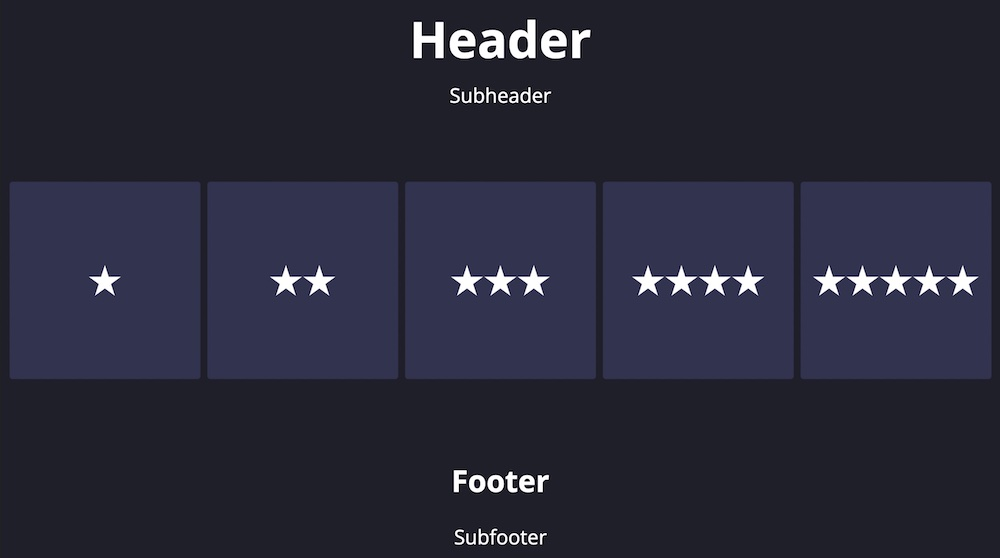

# Voting Kiosk
Voting Kiosk provides a touchscreen interface for collection single-question survey data and storing it on Control Server.

## Limitations
* Optimized for use with a horizontal display.
* The appearance of the kiosk cannot currently be customized.

## Configuration

### Choosing hardware
Voting Kiosk can operate from either a local machine (i.e., a Windows or Linux PC with a touchscreen display) or a remote client (such as an iPad). If using a remote client, it is still required to install Constellation Apps on a PC.

### Creating a layout definition

A `definition` is an `INI` file that describes how a single survey question should appear on the kiosk.

#### Kiosk settings
Every `definition` should have a `[SETTINGS]` section that sets up the overall language for the kiosk. A sample settings section:

```ini
[SETTINGS]
header = How Was the Show?
subheader = Tap a button below to rate this show
footer = Your feedback helps us improve
subfooter = Votes from this kiosk help us pick future planetarium shows
success = Got it!
recording_interval = 60
touch_cooldown = 2
```
</img>

The keys `header`, `subheader`, `footer`, and `subfooter` allow you to state the survey question and provide the user with some additional detail. Omitting a key leaves that line blank. The key `success` allows you to set the confirmation message that briefly appears when a vote is submitted.

The key `recording_interval` defines how long (in seconds) to collect a batch of data before sending it to Control Server. Each batch will be recorded with a timestamp. In general, you can leave this option alone.

The key `touch_cooldown` defines the minimum time (in seconds) between accepted votes. This is an anti-spam feature to keep repeated button presses from polluting the data.

###### Fine layout settings
In general, Voting Kiosk will create an appropriate layout for the display. However, you may fine-tune this layout by adjusting the below parameters. This is usually only necessary if you omit one or more of the headers/footers.

| Name          | Type   | Default | Meaning                                                                         |
|---------------|--------|---------|---------------------------------------------------------------------------------|
| top_height    | Number | auto    | Amount of vertical space for the header/subheader (in percent of screen height) |
| button_height | Number | auto    | Amount of vertical space for the button row (in percent of screen height)       |
| bottom_height | Number | auto    | Amount of vertical space for the footer/subfooter (in percent of screen height) |

#### Vote choices
After specifying a `[SETTINGS]` section, you must specify a section for each option in the survey. For example:

```ini
[SETTINGS]
...

[BAD]
title = Poor
icon = thumbs-down_red

[NEUTRAL]
title = Okay
icon = images/my_image.png

[GOOD]
title = Good
icon = thumbs-up_green
```

Each section name (i.e., `BAD`) will become the column name in the data spreadsheet stored on Control Server. Use the `text` field to describe the option and the `icon` field to provide an image. Custom images should be placed in the `images` directory and specified as shown for `[NEUTRAL]` above.

Voting Kiosk also provides a number of built-in images to cover many common use cases. To use a built-in image, give its name as shown above for `[BAD]` and `[GOOD]`

| 1-star_black                | 2-star_black                | 3-star_black                | 4-star_black                | 5-star_black                |
|-----------------------------|-----------------------------|-----------------------------|-----------------------------|-----------------------------|
|  |  |  |  |  |

| 1-star_white                | 2-star_white                | 3-star_white                | 4-star_white                | 5-star_white                |
|-----------------------------|-----------------------------|-----------------------------|-----------------------------|-----------------------------|
|  |  |  |  |  |

| thumbs-down_black                | thumbs-down_red                | thumbs-down_white                | thumbs-up_black                | thumbs-up_green                | thumbs-up_white                |
|----------------------------------|--------------------------------|----------------------------------|--------------------------------|--------------------------------|--------------------------------|
|  |  |  |  |  |  |

## Retrieving the data

Collected data is stored on Control Server in `JSON` format, and then converted to `CSV` for downloading. To download data for a given survey question, open the Control Server web console and navigate to _Settings_ > _Data_. Click the _Refresh_ button, and then select your data file from the dropdown list. The file will have the same name as your `defintion`. Click _Download_ to download the data as a `CSV` file that can be opened in any spreadsheet software.

