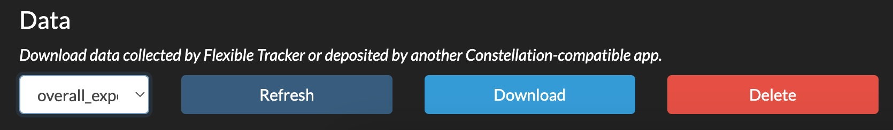

# Voting Kiosk
Voting Kiosk provides a touchscreen interface for collection single-question survey data and storing it on Control Server.

## Configuration

### Layout
Voting Kiosk will create a sensible layout for your question's options. With six or fewer options, they will be arranged in one row (landscape orientation) or one column (portrait). With more than six options, they will be arranged with four on each row (landscape) or two on each row (portrait).

## Retrieving the data

### Using Control Server

To download data for a given survey question, open the Control Server web console and navigate to _Analytics_ > _Data_. Click the _Refresh_ button, and then select your data file from the dropdown list. The file will have the same name as your `defintion`. Click _Download_ to download the data as a `CSV` file that can be opened in any spreadsheet software.

### Not using Control Server

Open the configuration screen and navigate to the _Apps_ tab. Find the Voting Kiosk card and use the download selector there.