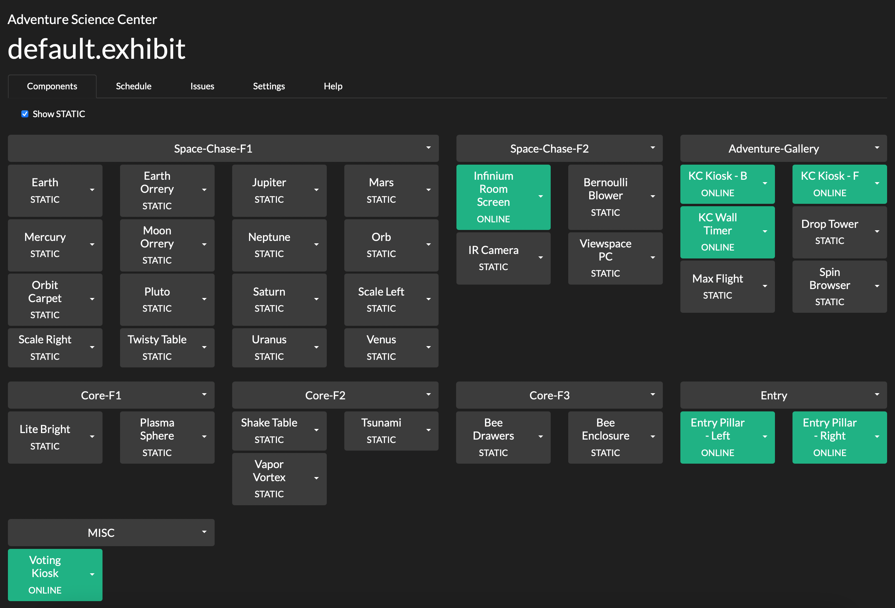
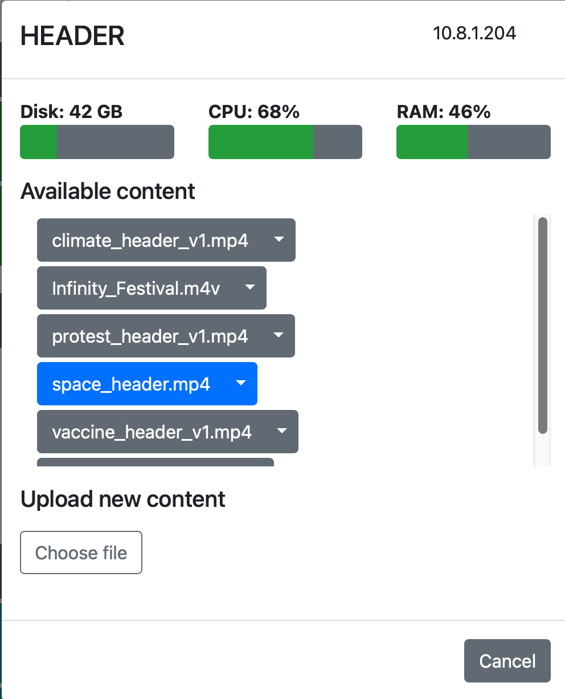
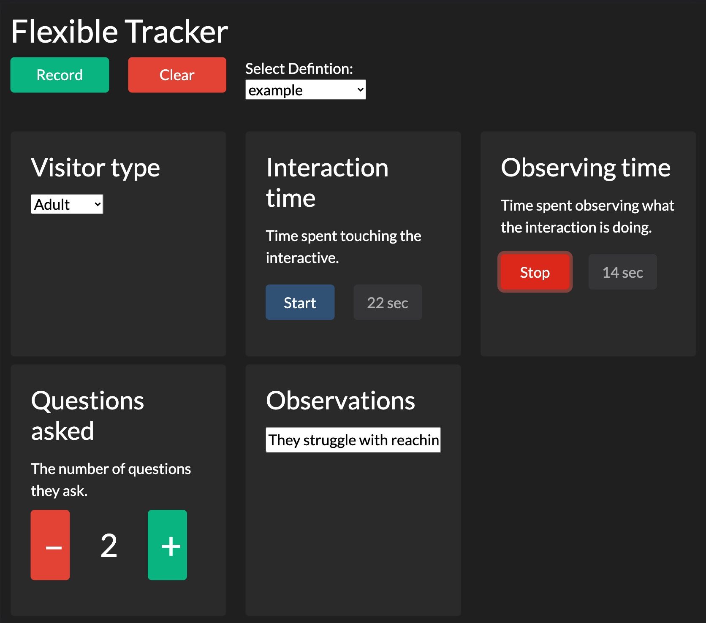

# Control Server

## Introduction

</img>

The control server coordinates communication between **_Constellation_** components and provides a web-based interface for controlling them. The server is implemented in Python 3 and the web console in Javascript.


## Terminology

* `gallery`: A physical space in which `exhibit`s take place.
* `exhibit`: The particular configuration of a `gallery`, including the inclusion or exclusion of specific `component`s and the `content` displayed by each `component`.
* `component`: A single display element within a `gallery`. This could be a projector, a screen, an iPad, or a hands-on mechanical interactive.
* `content`: The information being used by a `component`, such as text, images, video, and local configurations. Content specifies the file(s) on the component machine that should be used.
* `id`: A unique identifier for a given `component`. No two `component`s can have the same `id`.
* `type`: A user-defined grouping of `component`s. For example, if you have multiple screens each displaying similar information, you might assign them all the `type` of "INFO_SCREEN". `type`s allow you to send the same command to multiple devices. Every component must have a `type`.

## Setting up the Control Server

### Installation

This application requires Python 3.6 or later. To install, follow these steps:

1. Download the files from GitHub and place them somewhere permanent.
2. From a terminal within the directory, run `python3 -m pip install --upgrade -r requirements.txt` or ensure you have the below requirements satisfied.
3. Edit `currentExhibitConfiguration.ini` to update the required parameters as described [here](#basic-configuration).
4. Run `python3 control_server.py` to start the server
5. To use the web console, open a browser and go to `http://<control_server_ip>:<control_server_port>`.

If you wish to run multiple control servers so you can manage separate galleries independently, you must create a separate directory and instance of the server files for each server you wish to instantiate. Each server will need its own port, but they can all share the same IP address.

#### Required packages

The following packages are required to install the control server. For `pip`, they are listed in `requirements.txt`.

* [`icmplib`](https://github.com/ValentinBELYN/icmplib)
* [`pypjlink2`](https://github.com/benoitlouy/pypjlink)
* [`pywakeonlan`](https://github.com/remcohaszing/pywakeonlan)


### Configuration

#### currentExhibitConfiguration.ini

A `currentExhibitConfiguration.ini` file should be placed in the same directory as `control_server.py`. It contains the basic setup parameters for the server. The delimiter for this INI file is the equals sign (=).

##### Basic configuration
The following keywords are required in your `currentExhibitConfiguration.ini`:

* `server_ip_address`: This is the public IP address of the control server. Note that a static IP address needs to be set at the OS or network level—this value merely records what that address is for distribution to remote clients.
* `server_port`: The port you wish the control server to be accessible at. This port must not already be in use. Make sure that this port is not being blocked by a firewall.
* `current_exhibit`: The name of the current exhibit configuration file in the form of `<name>.exhibit`. Once the control server is initialized, it will automatically adjust the value of this keyword as you change exhibits using the web console.

The following keywords are optional:

* `gallery_name`: The name of the physical space this control server corresponds to, such as "The Smith Dinosaur Hall."
* `reboot_time`: A time (e.g., "3 AM", "23:59") at which the server will be automatically restarted every day. This helps prevent memory leaks and long-term instability, but is not strictly necessary.
* `assignable_staff`: A comma-separated list of names to whom issues can be assigned in the `Issues` tab.

##### Scheduling exhibit startup and shutdown

The contorl server can send commands to wake or sleep displays connected to every `component` and `projector` it controls. These are defined in `currentExhibitConfiguration.ini` and the keywords have the form `<day>_on` and `<day>_off`. The value for each keyword should be a time of day. These times can be specified in any common format, such as "2 PM", "2:00 PM", or "14:00". To omit a scheduled action, do not specify the keyword. An example schedule is below:

```
tuesday_on = 9 AM
tuesday_off = 5:00 PM
wednesday_on = 9 am
wednesday_off = 5:00 PM
thursday_on = 9 AM
thursday_off = 5:00 PM
friday_on = 9 AM
friday_off = 8 pm
saturday_on = 9 AM
saturday_off = 17:00
sunday_on = 12 PM
sunday_off = 5 PM
```

The easiest and best way to manage the schedule is through the web console's [Schedule Tab](#schedule-tab).

##### Controlling projectors
The control server can manage projectors over IP using the PJLink protocol or serial commands. Since this happens independently of whatever device is actually connected to the projector, projectors are not considered a `component` and do not have `content`. All projectors are assigned the `type` of "PROJECTOR".

###### PJLink
The PJLink protocol returns a defined set of information about the state of the connected projector. Each manufacturer implements the protocol slightly differently, so the available information may vary marginally.

PJLink projectors are defined in the `[PJLINK_PROJECTORS]` section as such:

```
[PJLINK_PROJECTORS]
myprojector = 10.8.0.177
secureProjector = 10.8.1.235, thePassword
```
Each line defines one projector, in which the keyword becomes the `id`. If a projector has a password for access to PJLink, specify it with a comma after the IP address.

###### Serial (RS-232)
The control server can also manage projectors that implement a serial-over-IP interface. You can also use a wireless serial adapter for projectors that do not implement serial-over-IP. Because every manufacturer implements a different set of functionality, the returned information is much more variable than over PJLink. **If PJLink is available, it is highly recommended.**

PJLink projectors are defined in the `[SERIAL_PROJECTORS]` section as such:

```
[SERIAL_PROJECTORS]
mySerialProjector = 10.8.0.175, barco
myOtherProjector = 10.8.1.234, christie
```

In addition to their IP address, you must specify the manufacturer of your device. Because some manufacturers vary their serial commands over generation, there is no guarantee that the control server supports your model, even if your manufacturer is supported. The following makes are at least partially supported:

| Make      | Known compatible models  |
| ----      | ------------------       |
| Barco     | F35                      |
| Christie  | DHD850-GS, Mirage HD8             |
| Optoma    |                          |
| Viewsonic |                          |

##### Wake on LAN

The control server can send Wake on LAN magic packets to power on machines connected to its network. These devices are specified using the MAC addresses, as such:

```
[WAKE_ON_LAN]
My_PC = B0:C7:30:95:93:C0
MY_PC2 = F1-E3-D1-51-B5-A1, 10.8.0.85
```
If the given machine has a static IP address, you can specify it on the same line, after a comma. The control server will ping that address at intervals to check if the machine is powered on. **To send pings on Windows, you must run the control server with administrator privileges.**

##### Tracking non-**_Constellation_** components

In order to view the real-time status of a `component`, it must be either  running a **_Constellation_** software system, or sending pings that conform to the API. However, non-**_Constellation_** `component`s can be added to the system in order to make use of the maintenance tracking system.

To add such a `component`, create a `[STATIC_COMPONENTS]` section in `currentExhibitConfiguration.ini`. The keys will be the `type` and the values will be the `id`s of the components. For example,

```
[STATIC_COMPONENTS]
INTERACTIVE = HAND_SIZE, FOOT_SIZE
DISPLAY = BODY_TYPES
```

will create three static components, HAND_SIZE and FOOT_SIZE of `type` INTERACTIVE, and BODY_TYPES of `type` DISPLAY.

##### Providing component descriptions

You can optionally specify a description for a `component`, which is displayed in the web console on that `component`'s status page. These are specified as such:

```
[COMPONENT_DESCRIPTIONS]
HEADER = The projector for the header at the entrance to the gallery
S_KIOSK = The kiosk near the exit where survey data is collected
```
where the `id` is given to the left of the equals sign and the description to the right.

#### Exhibit files
An exhibit file defines the content for a particular exhibit. It is in INI format, with the equals sign (=) as the separator. Each component has its own section. The `content` keyword defines the files that component should use. To specify multiple media pieces, separate them by a comma. For example, the content definition for two displays with `id`s of DISPLAY1 and DISPLAY2 would look like:

```
[DISPLAY1]
content = myvideo.mp4

[DISPLAY2]
content = anImage.jpg, myVideo2.MOV
```

Exhibit files should have the extension `.exhibit`, such as `space.exhibit`.

## Using the web console

The web console is the most convenient way of managing your settings and viewing the state of every `component`. It can be accessed through any modern web browser at the address `http://<control_server_ip>:<control_server_port>`.

### Components tab

The components tab lists every managed `component` and `projector`. Each receives its own tile, which is color-coded by the object's current state. States update automatically, so there is no need to refresh the page.


#### States

| State   | Component | Projector | Wake on LAN |
| -----   | --------- | --------- | ----------- |
| ACTIVE  | Component is currently being interacted with | - | - |
| ONLINE  | Component is responding | Projector is responding, and powered on | - |
| OFFLINE | Component is not responding | Projector is not responding | WoL system is not responding |
| STANDBY | - | Projector is responding, but powered off | - |
| STATIC | Component has been added for maintenance tracking purposes through currentExhibitConfiguration.ini. | - | - |
| SYSTEM ON | The computer is on, but no **_Constellation_** software is responding. | - | The WoL system is responding to pings |
| WAITING | The component was recently ONLINE. There may only be a temporary connectivity issue.  This is common if a display is sleeping. | - | - |
| UNKONWN | - | - | No IP address was supplied for this WoL system, so we cannot ping it to check its status. |

### Component status view

</img>

Clicking on a `component` opens its status view. Here, you can see a snapshot of the remote system's performance, manipulate its content (if supported), and add maintenance details.

#### System status

The system status area, located at the top, provides a summary of the performance of the computer running the `component`. These values are only estimates—if a `component` is behaving inconsistently, use the operating system's tools to diagnose the problem.

Note that CPU usage is not properly reported for `component`s running Windows.

#### Content pane

##### Content management

The content management area allows you to manipulate the displayed `content` for components that support it. Note that this panel only shows `content` managed by the system helper, including all `content` uploaded through the web console.

`Content` highlighted in blue is in the current display queue, which loops indefinitely. To add or remove a piece of `content`, click it to toggle it. These changes are not saved until the "Save changes" button is pressed.

`Content` can also be deleted from the system using the item's dropdown menu. Note that deleting content takes effect immediately and cannot be undone.

##### Content upload

New `content` can be uploaded using the bottom part of the Content pane. Click the "Choose file" button and select a file you wish to upload.

**Note that uploaded files cannot contain an equals sign (=).** If you upload a file with the same filename as a piece of existing `content`, the old file will be overwritten.

#### Maintenance pane

The maintenance pane allow you to track the maintenance status of the component. Four states are available:

* On floor, working
* On floor, not working
* Off floor, working
* Off floor, not working

In addition, you may add notes using the provided text box. Changes to the notes or status are not saved until the "Save changes" button has been pressed.

Changes to the maintenance status of a `component` are logged by the control server. These logs are in plain-text format in the `maintenance-logs` directory. Each line of a log is a JSON object containing the state at the time of submission.

### Projector status page

Clicking on a `projector` that is `ONLINE` or `STANDBY` will bring up its status page. Here, you can see an array of information reported by the projector using the PJLink protocol.

### Schedule tab

The schedule tab allows you to set recurring or one-off events within the `gallery`. The following options are available:

* Send power off and power on commands
* Refresh the `component`s
* Set the `exhibit`

Note that sending power off and power on commands may affect different `component`s differently. For `Projector`s, this will sleep or wake them. For `Wake on LAN` devices with shutdown permitted, the machine will be shutdown.

### Issues tab

The issues tab allows you to track issues with the gallery. Issues are not tied to a specific `exhibit`, but are a property of the overall space.

### Settings tab

#### Changing the exhibit

Use the "Set current exhibit" dropdown box to change the `exhibit` being displayed. **This change takes immediate effect and may result in an unsightly transition in public view.**

#### Creating and deleting exhibits

You can create and delete `exhibit`s from the settings tab. When creating an `exhibit`, you can either create an empty `exhibit` (no content for any `component`), or you can clone the existing `exhibit`.

#### Reloading currentExhibitConfiguration.ini

If you make a manual change to `currentExhibitConfiguration.ini`, pressing the "Reload Config" button will cause the control server to reload it and parse the new configuration as if it were starting up. This means you do not have to stop and restart the server process to make an update.

### Hiding tabs

The Schedule, Settings, and Help tabs can be hidden from view by modifying the URL. For example, to hide the schedule tab, change the URL to read `http://[Your IP]:[Your Port]/webpage.html?hideSchedule`. To hide both the help and settings tabs, use `http://[Your IP]:[Your Port]/webpage.html?hideHelp&hideSettings`.

Hiding tabs can be useful when creating a status console for frontline staff, without showing them the deeper configuration options. **Note that these options can be re-enabled simply by modifying the URL, so this is not a secure method of limiting access.**

## Using the flexible tracker
The `flexible tracker` enables the collection of a wide variety of quantitative and qualitative data using the control server. Collected data is stored as a list of JSON objects, one object per line, in a plain text document on the server.

### Collection types
The tracker can collect a variety of data types. Each type provides a widget that makes inputting the data easy and reliable.

| Type | Description | Required keywords | Optional keywords |
| ---- | ----------- | ------------------- | ------------------- |
| `counter` | Count by whole numbers, like a traditional "clicker" counter. | - | `label`: string |
| `dropdown` | Select one or more options from a list | `options`: comma-separated list of strings. | `multiple`: true/false (default: false) `label`: string |
| `number` | Record a single number, including decimals | - | `label`: string |
| `slider` | Record a single number, bounded in a user-defined range. The value is selected using a slider. | - | `min`: number (default: 1) <br> `max`: number (default: 100) <br> `step`: number (default: 1) <br> `start`: Inital slider position (default: `min`) <br> `label`: string |
| `text` | A textbox for inputting any text | - | `lines`: The height of the box in lines (default: 5) <br> `label`: string |
| `timer` | Records the number of seconds. Can be started and stopped by the user. "Exclusive" timers pause all other timers when started. | - | `exclusive`: true/false (default: false) <br> `label`: string |

### Creating a template

</img>

A `template` defines the collection types available for a given session. It allows you to customize the Flexible Tracker for your specific needs. Each template is an INI file located within Control Server in the directory `flexible-tracker/templates/<your template>.ini`. Within the `template`, each section header is the name of the item. Under each header, add keywords (one per line) to specify the desired collection. Keywords and values should be separated by an equals sign (`=`). The keyword `type` must appear in each section and **each section must have a unique name**. For example, the following `example.ini` will produce the displayed Flexible Tracker session.

```
[Visitor type]
type = dropdown
options = Adult, Child, Family, Field trip

[Interaction time]
type = timer
exclusive = true
label = Time spent touching the interactive.

[Observing time]
type = timer
exclusive = true
label = Time spent observing what the interaction is doing.

[Questions asked]
type = counter
label = The number of questions they ask.

[Observations]
type = text
```

Adding or modifying a `template` does not require restarting the Control Server; however, an instance of Flexible Tracker will need to be refreshed in order to reflect any changes.

### Recording data

To use Flexible Tracker for data collection, navigate to `<server address>:<server port>/tracker.html`. All available `template`s will be available from the dropdown list. Once you are ready to send a session (one set of observations), press the Record button. This will transmit the data to Control Server for storage. Please note that a network connection to the server is required to send data; if such a connection is not available, a popup will appear and the Record button will be disabled.

Data are stored in the Control Server under `flexible-tracker/data/<template name>.txt`. Each row is a single JSON object representing one session.

## Integrating with **_Constellation_**
The control server communicates with `component`s using HTTP requests. Connecting a custom `component` is as simple as sending and receiving the appropriate requests.

### Required actions

#### Pings

Control Server does not search for new `component`s. Rather, each `component` must send a request to the known static IP of the server. This is called a _ping_. A ping should be sent every five seconds as a POST request containing a JSON object with the following properties.


| Field   | Type | Value | Required | Meaning |
| -----   | --------- |--------- | --------- | --------- |
| class | String | "exhibitComponent" | Yes | - |
| id | String | A unique, user-defined value| Yes | - |
| type | String | A user-defined value | Yes | - |
| helperAddress | String | An HTTP address, including the port, of a server capable of responding to requests | No | This is required for the `component` to respond to certain commands, such as shutting down or restarting. |
| allowed_actions | array of strings | Any subset of ["restart", "shutdown", "sleep"] | No | Sending these values indicates that the `component` is able and willing to respond to their corresponding commands. Don't send an action if you have not implemented a method of responding to it. |
| currentInteraction | String | "true" or "false" | No | Send "true" if the `component` has been interacted with in the last 30 seconds. Send "false" if it has not. For a `component` with an attractor, you can also send "true" if the attractor is not displayed. |
| error | JSON object | The keys of the object should be the names of the errors, with the values being a short error message | No | This field allows you to report errors or warnings, which will be displayed on the web console. |
