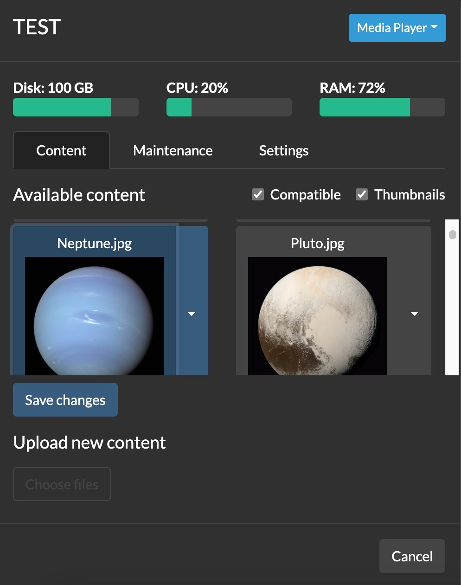
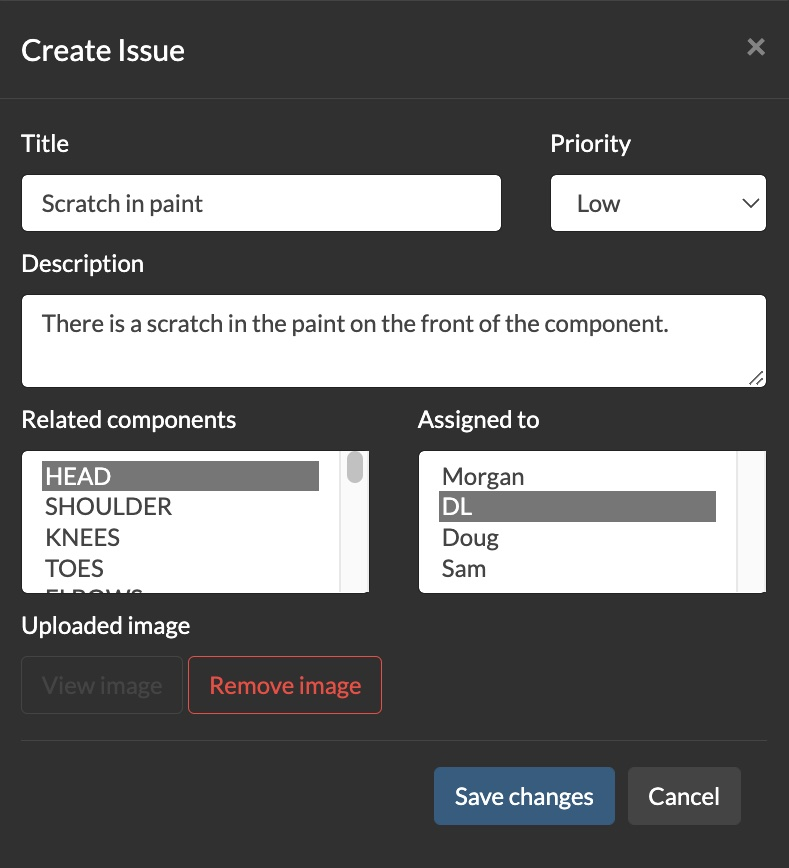
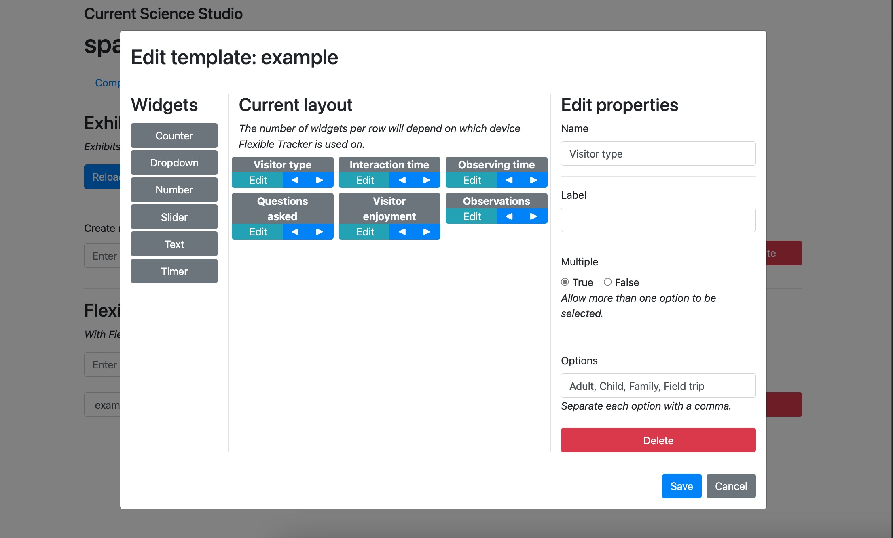

# Control Server

## Introduction

</img>

Control Server coordinates communication between **_Constellation_** components and provides a web-based interface for controlling them. It also provides tools for collecting qualitative and quantitative data, tracking maintenance, and logging exhibit issues.


## Terminology

* `gallery`: A physical space in which `exhibit`s take place.
* `exhibit`: The particular configuration of a `gallery`, including the inclusion or exclusion of specific `component`s and the `content` displayed by each `component`.
* `component`: A single display element within a `gallery`. This could be a projector, a screen, an iPad, or a hands-on mechanical interactive.
* `content`: The information being used by a `component`, such as text, images, video, and local configurations. Content specifies the file(s) on the component machine that should be used.
* `id`: A unique identifier for a given `component`. No two `component`s can have the same `id`.
* `type`: A user-defined grouping of `component`s. For example, if you have multiple screens each displaying similar information, you might assign them all the `type` of "INFO_SCREEN". `type`s allow you to send the same command to multiple devices. Every component must have a `type`.

## Setting up Control Server

### Configuring your environment
Many **_Constellation_** `components` will lose functionality if they cannot connect to Control Server. Thus, it is paramount that Control Server runs in a computing environment that is as stable as possible.

#### Environment requirements
* A static IP address
* On Windows, some secondary functionality requires running Control Server with administrator privileges

#### Environment recommendations
* Linux is strongly recommended as the operating system, followed by macOS. Everything should work under Windows, but testing is less thorough and the OS has lower uptime.
* A wired network connection is important to ensure a consistent connection.
* No aspect of **_Constellation_** requires access to the public internet (except checking for updates), although Control Server should be on a machine with accurate network time.

### First-time setup
The first time you launch Control Server, the terminal will launch an interactive setup wizard to walk you through basic configuration.

Once the wizard has completed, the server will start. After this point, all configuration will take place via the web console.

### Connecting to the web console
To access the web console from any device on the same subnet, open a browser and enter `http://[static_ip]:[port]`. Note that **_Constellation_** does not support HTTPS.

For example, if your static IP is 10.8.2.100, and your port is the default 8082, your web address would be `http://10.8.2.100:8082`. You can bookmark this address for future access.

### Configuration

To edit your configuration from the web console, navigate to the Settings tab and click _Edit Settings_. This will open a dialog with a basic configuration guide on the left and an editable text field on the right. When you are done making changes, click _Save_ to exit, then click _Reload Settings_ for them to take effect. Some significant changes, such as editing the IP address or port, will require you to shut down Control Server and launch it again.

Under the hood, the configuration is stored in the file, `galleryConfiguration.ini`. This file, located in the root of your Control Server installation, can also be edited in any text editor.

#### Basic configuration
The following keywords are required:

* `server_ip_address`: This is the public IP address of the Control Server PC. Note that a static IP address needs to be set at the OS or network level—this value merely records what that address is for distribution to remote clients.
* `server_port`: The port you wish Control Server to be accessible at. This port must not already be in use. Make sure that this port is not being blocked by a firewall.
* `current_exhibit`: The name of the current exhibit configuration file in the form of `<name>.exhibit`. Once Control Server is initialized, it will automatically adjust the value of this keyword as you change exhibits using the web console.

The following keywords are optional:

* `gallery_name`: The name of the physical space this control server corresponds to, such as "The Smith Dinosaur Hall."
* `assignable_staff`: A comma-separated list of names to whom issues can be assigned in the `Issues` tab.

#### Controlling projectors
Control Server can manage projectors over IP using the PJLink protocol or serial commands. Since this happens independently of whatever device is actually connected to the projector, projectors are not considered a `component` and do not have `content`. All projectors are assigned the `type` of "PROJECTOR".

##### PJLink
The PJLink protocol returns a defined set of information about the state of the connected projector. Each manufacturer implements the protocol slightly differently, so the available information may vary marginally.

PJLink projectors are defined in the `[PJLINK_PROJECTORS]` section as such:

```ini
[PJLINK_PROJECTORS]
myProjector = 10.8.0.177
secureProjector = 10.8.1.235, thePassword
```
Each line defines one projector, in which the keyword becomes the `id`. If a projector has a password for access to PJLink, specify it with a comma after the IP address.

##### Serial (RS-232)
Control Server can also manage projectors that implement a serial-over-IP interface. You can also use a wireless serial adapter for projectors that do not implement serial-over-IP. Because every manufacturer implements a different set of functionality, the returned information is much more variable than over PJLink. **If PJLink is available, it is highly recommended.**

Serial projectors are defined in the `[SERIAL_PROJECTORS]` section as such:

```ini
[SERIAL_PROJECTORS]
mySerialProjector = 10.8.0.175, barco
myOtherProjector = 10.8.1.234, christie
```

In addition to their IP address, you must specify the manufacturer of your device. Because some manufacturers vary their serial commands over generation, there is no guarantee that the control server supports your model, even if your manufacturer is supported. The following makes are at least partially supported:

| Make      | Known compatible models |
|-----------|-------------------------|
| Barco     | F35                     |
| Christie  | DHD850-GS, Mirage HD8   |
| Optoma    |                         |
| Viewsonic |                         |

#### Wake on LAN

Control Server can send Wake on LAN magic packets to power on machines connected to its network. These devices are specified using MAC addresses, as such:

```ini
[WAKE_ON_LAN]
My_PC = B0:C7:30:95:93:C0
MY_PC2 = F1-E3-D1-51-B5-A1, 10.8.0.85
```
If the given machine has a static IP address, you can specify it following a comma on the same line. Control Server will ping that address at intervals to check if the machine is powered on. **To send pings on Windows, you must run Control Server with administrator privileges.**

#### Tracking non-**_Constellation_** components

In order to view the real-time status of a `component`, it must be either running a **_Constellation_** app, or sending pings that conform to the API. However, non-**_Constellation_** `components` can be added in order to make use of the maintenance tracking system.

To add such a `component`, create a `[STATIC_COMPONENTS]` section in `galleryConfiguration.ini`. The keys will be the `type` and the values will be the `id`s of the components. For example,

```ini
[STATIC_COMPONENTS]
INTERACTIVE = HAND_SIZE, FOOT_SIZE
DISPLAY = BODY_TYPES
```

will create three static components, HAND_SIZE and FOOT_SIZE of `type` INTERACTIVE, and BODY_TYPES of `type` DISPLAY.

#### Providing component descriptions

You can optionally specify a description for a `component`, which is displayed in the web console on that `component`'s status page. These are specified as such:

```ini
[COMPONENT_DESCRIPTIONS]
HEADER = The projector for the header at the entrance to the gallery
S_KIOSK = The kiosk near the exit where survey data is collected
```
where the `id` is given to the left of the equals sign and the description to the right.

## Using the web console

The web console is the most convenient way of managing your settings and viewing the state of every `component`. It can be accessed through any web browser at the address `http://<control_server_ip>:<control_server_port>`.

### Components tab

The components tab lists every managed `component` and `projector`. Each receives its own tile, which is color-coded by the object's current state. States update automatically, so there is no need to refresh the page.


#### States

| State     | Component                                                                                                                      | Projector                                | Wake on LAN                                                                               |
|-----------|--------------------------------------------------------------------------------------------------------------------------------|------------------------------------------|-------------------------------------------------------------------------------------------|
| ACTIVE    | Component is currently being interacted with                                                                                   | -                                        | -                                                                                         |
| ONLINE    | Component is responding                                                                                                        | Projector is responding, and powered on  | -                                                                                         |
| OFFLINE   | Component is not responding                                                                                                    | Projector is not responding              | WoL system is not responding                                                              |
| STANDBY   | -                                                                                                                              | Projector is responding, but powered off | -                                                                                         |
| STATIC    | Component has been added for maintenance tracking purposes.                                                                    | -                                        | -                                                                                         |
| SYSTEM ON | The computer is on, but no **_Constellation_** software is responding.                                                         | -                                        | The WoL system is responding to pings                                                     |
| WAITING   | The component was recently ONLINE. There may only be a temporary connectivity issue.  This is common if a display is sleeping. | -                                        | -                                                                                         |
| UNKNOWN   | -                                                                                                                              | -                                        | No IP address was supplied for this WoL system, so we cannot ping it to check its status. |

### Component status view

</img>

Clicking on a `component` opens its status view. Here, you can see a snapshot of the remote system's performance; manipulate its content and settings; and add maintenance details.

#### System status

The system status area, located at the top, provides a summary of the performance of the computer running the `component`. These values are only estimates—if a `component` is behaving inconsistently, use the operating system's tools to diagnose the problem.

Note that CPU usage is not properly reported for PCs running Windows.

#### Content pane

##### Content management

The content management area allows you to manipulate the displayed `content` for components that support it. Note that this panel only shows files managed by Constellation, including all `content` uploaded through the web console.

`Content` highlighted in blue is currently selected. To add or remove a piece of `content`, click it to toggle it. These changes are not saved until the _Save changes_ button is pressed.

`Content` can also be deleted from the system using the item's dropdown menu. Note that deleting content takes effect immediately and cannot be undone.

##### Content upload

New `content` can be uploaded using the bottom part of the Content pane. Click _Choose files_ and select one or more files that you wish to upload.

**Note that uploaded filenames cannot contain an equals sign (=).** If you upload a file with the same filename as a piece of existing `content`, the old file will be overwritten. The name of the file on your device will be carried over to the client.

#### Maintenance pane

The maintenance pane allow you to track the maintenance status of the component. Four states are available:

* On floor, working
* On floor, not working
* Off floor, working
* Off floor, not working

In addition, you may add notes using the provided text box. Changes to the notes or status are not saved until the _Save changes_ button has been pressed.

Changes to the maintenance status of a `component` are logged by the control server. These logs are in plain-text format in the `maintenance-logs` directory. Each line of a log is a JSON object containing the state at the time of submission.

#### Projector status page

Clicking on a `projector` that is `ONLINE` or `STANDBY` will bring up its status page. Here, you can see an array of information reported by the projector using the PJLink protocol.

### Schedule tab

The schedule tab allows you to set recurring or one-off events within the `gallery`. The following options are available:

* Send power on, power off, and restart commands
* Refresh `components`
* Set the `exhibit`
* Set `content` for a single `component`

Note that sending power off and power on commands may affect different `component`s differently. For `projectors`, this will sleep or wake them. For `Wake on LAN` devices with shutdown permitted, the machine will be shutdown.

### Issues tab

</img>

The issues tab organizes information about the current state of the `gallery` and its `components`. It provides an easy interface for non-technical users to alert maintenance staff about a problem, as well as to see a summary of the overall `gallery` health.

#### Issues

Issues are not tied to a specific `exhibit`, but are a property of the overall space. They can be connected to a **_Constellation_** `component` or simply a note about the state of the facility. When creating an issue, you can give it a priority, assign it to a specific person, and connect it with a `component`. You can also upload a photo for reference. If you're using the web console on a mobile device, you can even take the picture directly from within the interface.

Known issues can be filtered by priority and who they are assigned to.

#### Maintenance overview

The maintenance overview summarizes the current state of the `components`. From the component status view on the components tab, maintenance staff can enter notes about various pieces, as well as categorize them into one of four groups:

- On the floor and working
- On the floor and not working
- Off the floor and working
- Off the floor and not working

The various `components` are grouped into these categories on the maintenance overview. The status bar underneath each `id` shows the fraction of time the `component` has been working or not working.

### Settings tab

#### Changing the exhibit

Use the _Set current exhibit_ dropdown box to change the `exhibit` being displayed. **This change takes immediate effect and may result in an unsightly transition in public view.**

#### Creating and deleting exhibits

You can create and delete `exhibits` from the settings tab. When creating an `exhibit`, you can either create an empty `exhibit` (no content for any `component`), or you can clone the existing `exhibit`.

#### Reloading galleryConfiguration.ini

If you make a manual change to `galleryConfiguration.ini`, pressing the "Reload Config" button will cause the control server to reload it and parse the new configuration as if it were starting up. This means you do not have to stop and restart the server process to make an update. _Note that some low-level properties (such as the IP address or port) require a complete restart of Control Server to take effect_.

### Hiding tabs

The tabs can be hidden from view by modifying the URL. For example, to hide the schedule tab, change the URL to read `http://[Your IP]:[Your Port]/webpage.html?hideSchedule`. To hide both the help and settings tabs, use `http://[Your IP]:[Your Port]/webpage.html?hideHelp&hideSettings`.

Hiding tabs can be useful when creating a status console for certain staff, without showing them the deeper configuration options. **Note that these options can be re-enabled simply by modifying the URL, so this is not a secure method of limiting access.**

## Using the Flexible Tracker

</img>

The Flexible Tracker enables the collection of a wide variety of quantitative and qualitative data using Control Server. Collected data can then be downloaded as a standard CSV file for opening in any spreadsheet software.

### Collection types
Flexible Tracker can collect a variety of data types. Each type provides a widget that makes inputting the data easy and reliable.

| Type       | Description                                                                                                                              | Required keywords                           | Optional keywords                                                                                                                                                                  |
|------------|------------------------------------------------------------------------------------------------------------------------------------------|---------------------------------------------|------------------------------------------------------------------------------------------------------------------------------------------------------------------------------------|
| `counter`  | Count by whole numbers, like a traditional tally counter.                                                                                | -                                           | `label`: string                                                                                                                                                                    |
| `dropdown` | Select one or more options from a list                                                                                                   | `options`: comma-separated list of strings. | `multiple`: true/false (default: false) `label`: string                                                                                                                            |
| `number`   | Record a single number, including decimals                                                                                               | -                                           | `label`: string                                                                                                                                                                    |
| `slider`   | Record a single number, bounded in a user-defined range. The value is selected using a slider.                                           | -                                           | `min`: number (default: 1) <br> `max`: number (default: 100) <br> `step`: number (default: 1) <br> `start`: Inital slider position (default: `(min + max)/2`) <br> `label`: string |
| `text`     | A textbox for inputting any text                                                                                                         | -                                           | `lines`: The height of the box in lines (default: 5) <br> `label`: string                                                                                                          |
| `timer`    | Records the number of seconds. Can be started and stopped by the user. "Exclusive" timers pause all other exclusive timers when started. | -                                           | `exclusive`: true/false (default: false) <br> `label`: string                                                                                                                      |

### Creating a template

</img>

A `template` defines the collection types available for a given session. It allows you to customize Flexible Tracker for your specific needs. The recommended way to create a template is through the web console.

#### Using the web console

To create a `template` via the web console, navigate to the settings tab. In the Flexible Tracker section, select the `template` you want to edit, first creating it if necessary. Then, click _Edit_ to pop up the template editor. The left column contains the possible collection type widgets. Click on one to add it to the current layout, and customize its parameters using the fields in the right column.

With the left and right arrows, you can reorder how the widgets will appear. Because Flexible Tracker is a responsive web page, the exact arrangement of the widgets will depend on your device's screen size and shape.

#### Creating a template manually

Each template is an INI file located within Control Server in the directory `flexible-tracker/templates/<your template>.ini`. Within the `template`, each section header is the name of the item. Under each header, add keywords (one per line) to specify the desired collection. Keywords and values should be separated by an equals sign (`=`). The keyword `type` must appear in each section and **each section must have a unique name**. For example, the following `example.ini` will produce the displayed Flexible Tracker session.

```ini
[Visitor type]
type = dropdown
options = Adult, Child, Family, Field trip

[Interaction time]
type = timer
exclusive = true
label = Time spent touching the interactive.

[Observing time]
type = timer
exclusive = true
label = Time spent observing what the interaction is doing.

[Questions asked]
type = counter
label = The number of questions they ask.

[Observations]
type = text
```

Adding or modifying a `template` does not require restarting the Control Server; however, an instance of Flexible Tracker will need to be refreshed in order to reflect any changes.

### Recording data

To use Flexible Tracker for data collection, select yoru desired `template` from the web console settings view and click the "Launch" button. All available `template`s will be available from the dropdown list. Once you are ready to send a session (one set of observations), press the Record button. This will transmit the data to Control Server for storage. Please note that a network connection to the server is required to send data; if such a connection is not available, a popup will appear and the Record button will be disabled.

Data are stored in the Control Server under `flexible-tracker/data/<template name>.txt`. Each row is a single JSON object representing one session.

### Downloading and managing data

Once you have collected some data, you can easily download it as a comma-separated values (CSV) file that cane be read by Microsoft Excel or another data analysis app. To do so, go to the settings view from the web console and select the appropriate `template`. Then, click the "Download data" button and a CSV download will be initiated in your browser.

By clicking the "Clear data" button, you can erase the existing data. This action cannot be undone.

