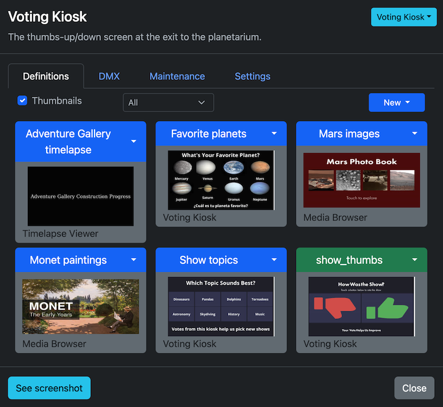
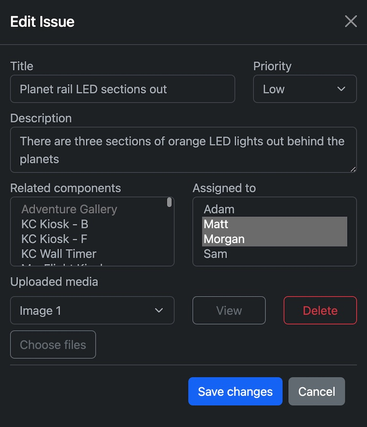
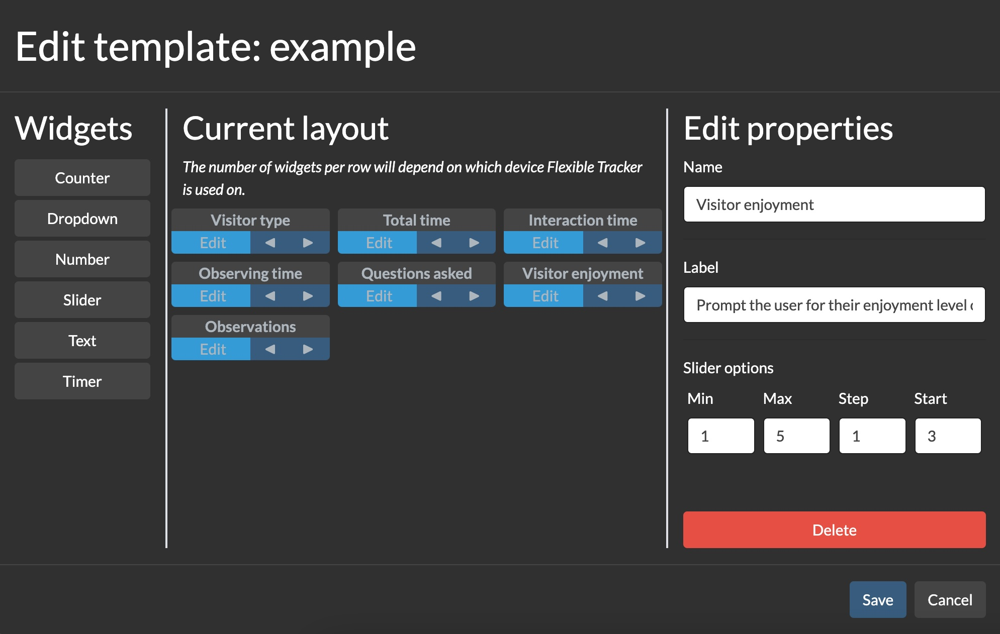

# Control Server

## Introduction

</img>

Control Server coordinates communication between Constellation components and provides a web-based interface for controlling them. It also provides tools for collecting qualitative and quantitative data, tracking maintenance, and logging exhibit issues.

## Terminology

* `gallery`: A physical space in which exhibits take place.
* `exhibit`: A configuration for a `gallery` that assigns a `definition` to each `component`.
* `component`: A single display element within a `gallery`. This could be a projector, a screen, an iPad, or a hands-on mechanical interactive.
* `content`: Files such as text, images, videos, or spreadsheets that make up a `definition`.
* `definition`: The specific configuration of a given `component`, made up of `content` and settings.
* `id`: A unique identifier for a given `component`. No two components can have the same `id`.
* `group`: A user-defined grouping of components. For example, if you have multiple screens each displaying similar information, you might assign them all the group of "INFO SCREEN". Groups allow you to send the same command to multiple devices. Every component must have a group.

## Setting up Control Server

### Configuring your environment
Many Constellation components will lose functionality if they cannot connect to Control Server. Thus, it is paramount that Control Server runs in a computing environment that is as stable as possible.

#### Environment requirements
* A static IP address.
* On Windows, some secondary functionality requires running Control Server with administrator privileges.

#### Environment recommendations
* A wired network connection is important to ensure a consistent connection.
* No aspect of Constellation requires access to the public internet (except checking for updates), although Control Server should be on a machine with accurate network time.

### First-time setup
The first time you launch Control Server, the terminal will launch an interactive setup wizard to walk you through basic configuration.

Once the wizard has completed, the server will start. After this point, all configuration will take place via the web console.

### Connecting to the web console
To access the web console from any device on the same subnet, open a browser and enter `http://[static_ip]:[port]`. Note that **_Constellation_** does not support HTTPS.

For example, if your static IP is `10.8.2.100`, and your port is the default `8082`, your web address would be `http://10.8.2.100:8082`. You can bookmark this address for future access.

### Configuration
Basic settings, such as the IP address and port, can be configured from the _Settings_ tab. These settings may require Control Server to be restarted before they take effect.

Control Server enables you to manage and track several types of devices beyond the apps provided by Constellation Apps. These include projectors, PCs configured to respond to Wake on LAN requests, as well as a category for generic items. To add one of these items, click the _Add_ button on the _Components_ tab.

#### Controlling projectors
Control Server can manage projectors over IP using the PJLink protocol.

The PJLink protocol returns a defined set of information about the state of the connected projector. Each manufacturer implements the protocol slightly differently, so the available information may vary marginally.

To configure a PJLink projector, it should have a static IP address. Some projectors require a password, which you can also specify here.

#### Wake on LAN

Control Server can send Wake on LAN magic packets to power on machines connected to its network. 

To configure a component for Wake on LAN, you must specify its MAC address. If the given machine has a static IP address, you can also provide it. Control Server will ping that address at intervals to check if the machine is powered on. **To send pings on Windows, you must run Control Server with administrator privileges.**

#### Static Components

In order to view the real-time status of a component, it must be either running Constellation Apps or sending pings that conform to the API. However, non-Constellation components can be added in order to make use of the maintenance tracking system.

## Using the web console

The web console provides an interface for managing settings and seeing the real-time status of every component. It can be accessed through any web browser at the address `http://<control_server_ip>:<control_server_port>`.

Multiple users may access the web console simultaneously.

### Components tab

The _Components_ tab lists every managed component and projector, each with its own tile.

#### View options
The _View options_ menu enables you to customize the components interface. You can toggle on or off the display of static components, and modify the data presented by each tile.

#### Real-time status

The default view option is the real-time status of each component. The possible status options are listed below. This view gives you immediate feedback on the current state of your components.

| State     | Component                                                                                                                      | Projector                                | Wake on LAN                                                                               |
|-----------|--------------------------------------------------------------------------------------------------------------------------------|------------------------------------------|-------------------------------------------------------------------------------------------|
| ACTIVE    | Component is currently being interacted with                                                                                   | -                                        | -                                                                                         |
| ONLINE    | Component is responding                                                                                                        | Projector is responding and powered on   | -                                                                                         |
| OFFLINE   | Component is not responding                                                                                                    | Projector is not responding              | WoL system is not responding                                                              |
| STANDBY   | -                                                                                                                              | Projector is responding, but powered off | -                                                                                         |
| STATIC    | Component has been added for maintenance tracking purposes.                                                                    | -                                        | -                                                                                         |
| SYSTEM ON | The computer is on, but no Constellation software is responding.                                                               | -                                        | The WoL system is responding to pings                                                     |
| WAITING   | The component was recently ONLINE. There may only be a temporary connectivity issue.  This is common if a display is sleeping. | -                                        | -                                                                                         |
| UNKNOWN   | -                                                                                                                              | -                                        | No IP address was supplied for this WoL system, so we cannot ping it to check its status. |

#### Maintenance status

The maintenance status view shows the current maintenance state of each component, as set by the user. This view provides a long-term overview of the state of the components. See the below _Maintenance pane_ section for more information on the possible states.

### Component status view

</img>

Clicking on a component opens its status view. Here, you can see a snapshot of the remote system's performance, select a definition, change settings, and add maintenance details.

#### Definitions pane

The _Definitions_ pane allows you to select the app definition that you want to display. A given component can have only one active definition. If the definition you selected belongs to an app other than the one that is currently active, the app will be changed before the new definition is applied.

#### Maintenance pane

The _Maintenance_ pane allow you to track the maintenance status of the component. Four states are available:

* On floor, working
* On floor, not working
* Off floor, working
* Off floor, not working

In addition, you may add notes using the provided text box. Changes to the notes or status are not saved until the _Save changes_ button has been pressed. On the right side of the _Maintenance_ pane, issues related to this component are listed. See the section _Issues_ below for more information.

##### System status

The system status area, located at the top of the _maintenance_ pane, provides a summary of the performance of the computer running the component. These values are only estimates—if a component is behaving inconsistently, use the operating system's tools to diagnose the problem.

Note that CPU usage is not properly reported for PCs running Windows.

#### Settings pane

The _Settings_ pane allows you to quickly update certain component settings, as well as launch the full settings page for that component. You can also give the component a short description to help others understand what this component is.

#### Projector status view

Clicking on a projector that is `ONLINE` or `STANDBY` will bring up its status page. Here, you can see an array of information reported by the projector using the PJLink protocol.

### Schedule tab

The _Schedule_ tab allows you to set recurring or one-off events within the gallery. The following options are available:

* Send power on, power off, and restart commands
* Refresh components
* Set the exhibit
* Set the definition for a component
* Set a DMX scene for a component
* Add an explanatory note

Note that sending power off and power on commands may affect different components differently. For projectors, this will sleep or wake them.

### Maintenance tab

</img>

The _Maintenance_ tab organizes information about the current state of the gallery and its components. It provides an easy interface for non-technical users to alert maintenance staff about a problem.

#### Issues

Issues enable you to track ongoing problems with galleries and components. You can attach images and videos to clarify the concern, connect it with a Constellation component, and assign the task to one or more staff members.

Known issues can be filtered by priority and who they are assigned to. Any issues attached to a given component will also appear on the component status view. Once a fix has been made, the issue can be marked as complete. This deletes any attached media and archives the issue for later reference.

### Analytics tab

The _Analytics_ tab allows you to configure Flexible Tracker, a powerful tool for creating data-collection interfaces.

</img>

Flexible Tracker enables the collection of a wide variety of quantitative and qualitative data using Control Server. Collected data can then be downloaded as a standard CSV file for opening in any spreadsheet software.

### Collection types
Flexible Tracker can collect a variety of data types. Each type provides a widget that makes inputting the data easy and reliable.

| Type     | Description                                                                                                                              |
|----------|------------------------------------------------------------------------------------------------------------------------------------------|
| Counter  | Count by whole numbers, like a traditional tally counter.                                                                                |
| Dropdown | Select one or more options from a list                                                                                                   |
| Number   | Record a single number, including decimals                                                                                               |
| Slider   | Record a single number, bounded in a user-defined range. The value is selected using a slider.                                           | -                                           |
| Text     | A textbox for inputting any text                                                                                                         |
| Timer    | Records the number of seconds. Can be started and stopped by the user. "Exclusive" timers pause all other exclusive timers when started. |

### Creating a template

</img>

A _template_ defines the collection types available for a given session. It allows you to customize Flexible Tracker for your specific needs.

To create a template, navigate to the settings tab. In the Flexible Tracker section, select the template you want to edit, first creating it if necessary. Then, click _Edit_ to pop up the template editor. The left column contains the possible collection type widgets. Click on one to add it to the current layout, and customize its parameters using the fields in the right column.

With the left and right arrows, you can reorder how the widgets will appear. Because Flexible Tracker is a responsive web page, the exact arrangement of the widgets will depend on your device's screen size and shape.

### Recording data

To use Flexible Tracker for data collection, select your desired template from the web console settings view and click the _Launch_ button. All available templates will be available from the dropdown list. Once you are ready to send a session (one set of observations), press the Record button. This will transmit the data to Control Server for storage. Please note that a network connection to the server is required to send data; if such a connection is not available, a popup will appear and the Record button will be disabled.

Data are stored in Control Server under `flexible-tracker/data/<template name>.txt`. Each row is a single JSON object representing one session.

### Downloading and managing data

Once you have collected some data, you can easily download it as a comma-separated values (CSV) file that cane be read by Microsoft Excel or another data analysis app. To do so, go to the settings view from the web console and select the appropriate template. Then, click the "Download data" button and a CSV download will be initiated in your browser.

By clicking the _Clear data_ button, you can erase the existing data. This action cannot be undone.

### Settings tab

#### Changing the exhibit

Use the _Set current exhibit_ dropdown box to change the exhibit being displayed. **This change takes immediate effect and may result in an unsightly transition in public view.**

#### Creating and deleting exhibits

You can create and delete exhibits from the settings tab. When creating an exhibit, you can either create an empty exhibit (no definition for any component), or you can clone the existing exhibit.
